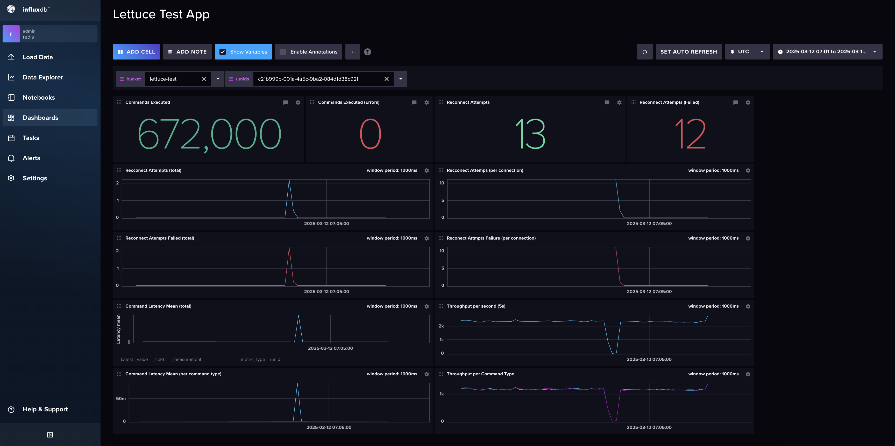

# Importing Lettuce Test App Dashboard and Variables into InfluxDB 2.0
 
This guide will help you import the `lettuce_test_app.json` dashboard and the `variables` (`bucket.json` and `runids.json`) into InfluxDB 2.0.

## Prerequisites

 - InfluxDB 2.0 installed and running
 - InfluxDB 2.0 CLI installed
 - `lettuce_test_app.json`, `bucket.json`, and `runids.json` files

## Importing the Dashboard

 1. Open the InfluxDB 2.0 UI.
 2. Navigate to the Dashboards section.
 3. Click on the "Import" button.
 4. Select the `lettuce_test_app.json` file and import it.

## Importing Variables

 1. Open the InfluxDB 2.0 UI.
 2. Navigate to the Variables section.
 3. Click on the "Import" button.
 4. Select the `bucket.json` and `runids.json` files and import them.

## How to Use

 - Ensure the correct bucket is selected.
 - The `runId` can be taken from log files. For example:

 ```
 2025-03-12 09:04:24.011 - Counter: MeterId{name='lettuce.reconnect.attempts', tags=[tag(epid=0x1),tag(local=local:any),tag(remote=localhost/<unresolved>:6379),tag(runId=c21b999b-001a-4a5c-9ba2-084d1d38c92f)]} value: 12.0
 ```

 - Ensure the correct time range is selected.

## Example Image

 

## References

 - [InfluxDB 2.0 Documentation](https://docs.influxdata.com/influxdb/v2.0/)
 - [InfluxDB 2.0 CLI Documentation](https://docs.influxdata.com/influxdb/v2.0/reference/cli/influx/)

 Save this content in a file named `README.md` in your project directory.